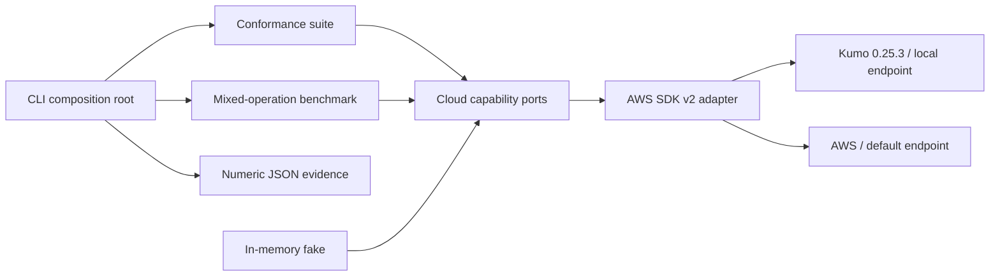

# #13 mini-aws-emulator: 100% scoped conformance at 2.121 ms p95

**Claim:** one AWS SDK v2 adapter preserves 18 scoped S3, SQS, and DynamoDB behaviors when switched between pinned Kumo and real AWS configuration.

**Benchmark:** `18/18` checks, `225` measured operations, `2.121 ms` p95, `754.371 ops/s`, and zero functional failures.

[](https://github.com/Brilhante29/mini-aws-emulator/actions/workflows/ci.yml)

## What It Proves

- S3 bucket and object lifecycle behavior works through the official AWS SDK v2.
- SQS queue, send, receive, delete, and list behavior preserves message bodies.
- DynamoDB table and item lifecycle behavior preserves strongly read values.
- The conformance and benchmark packages depend on narrow cloud ports, not AWS packages.
- One adapter targets Kumo with an endpoint override or AWS with default endpoints.
- The default path needs no cloud account, paid API, persistent data, or secret.
- Real AWS execution is refused without an explicit opt-in and unique run identifier.

This project does not reimplement Kumo. It provides the compatibility, safety, architecture, and benchmark layer around a pinned Kumo runtime.

## Run With Docker

```powershell
docker build -t mini-aws-emulator .
docker run --rm mini-aws-emulator
```

The second command starts Kumo inside the container, waits for health, executes the 18 checks, measures 225 operations, prints JSON, cleans up, and exits.

Save the committed baseline on Windows:

```powershell
powershell -NoProfile -ExecutionPolicy Bypass -File tools/benchmark.ps1
```

Linux and macOS:

```bash
./tools/benchmark.sh
```

A two-container development path is also available:

```powershell
docker compose up --build --abort-on-container-exit --exit-code-from conformance
```

## Benchmark Result

| Metric | Baseline | Confirmation | Direction |
|---|---:|---:|---|
| conformance_rate_percent | 100 | 100 | exactly 100 |
| passed_checks | 18/18 | 18/18 | all |
| p95_operation_latency_ms | 2.121 | 1.688 | lower |
| operations_per_second | 754.371 | 758.296 | higher |
| measured_operations | 225 | 225 | fixed |
| failed_operations | 0 | 0 | exactly 0 |
| startup_ms | 107.621 | 59.671 | lower |
| core_coverage_percent | 81.2 | 81.2 | >= 75 |
| sdk_response_close_warnings | 83 | 83 | diagnostic |

Inputs: 25 iterations of nine operations after the conformance suite and resource setup warm the runtime. Each iteration measures S3 put/get/delete, DynamoDB put/get/delete, and SQS send/receive/delete.

Environment: Docker Desktop 27.4.0, Linux/amd64, 16 CPUs, 16.45 GB Docker memory, Go 1.25.10, AWS SDK Go v2 1.41.9, Smithy Go 1.26.0, and Kumo 0.25.3. The Kumo image is pinned to `sha256:7ea090ae0b6d1d34615e8b7bd04a2f1cd864ec640a6826a91e90f40e975e196b`.

The primary result was identical. Confirmation throughput differed by 0.52%; its p95 was 20.42% lower, expected at this sub-3 ms scale on Docker Desktop. Measured on 2026-07-15.

Committed evidence:

- `benchmarks/results/kumo-baseline.json`
- `benchmarks/results/kumo-confirmation.json`

## Compatibility Diagnostic

Kumo 0.25.3 completes the scoped S3 calls, but Smithy emits a response-body close warning after each S3 response. The logger converts only that exact known warning into `sdk_response_close_warnings`; every other SDK warning remains visible.

The expected count is deterministic:

```text
6 S3 conformance calls
+ 2 benchmark setup/cleanup calls
+ 25 iterations * 3 measured S3 calls
= 83 diagnostics
```

This count is not treated as a functional pass or silently discarded. It records an SDK/emulator compatibility gap alongside the 18 behavioral assertions. Local S3 optional checksums are configured `when_required`; real AWS retains the SDK default.

## Architecture



Dependency direction:

```text
CLI + AWS adapter -> conformance/benchmark -> cloud capability ports
```

Only `internal/adapters/awssdk` imports AWS SDK packages. Kumo is an executable dependency, not a source-code dependency.

## Scoped Contract

| Service | Checks |
|---|---|
| S3 | create bucket, put/get/list/delete object, delete bucket |
| SQS | create queue, send/receive/delete message, list/delete queue |
| DynamoDB | create table, put/get/delete item, confirm absence, delete table |

The benchmark measures nine functional operations per iteration. Setup, cleanup, and the 18 conformance checks are not included in operation latency.

## Local And Real Cloud

Local mode is the default:

```text
CLOUD_PROVIDER=kumo
CLOUD_ENDPOINT=http://127.0.0.1:4566
AWS_REGION=us-east-1
```

Real AWS uses the same adapter and SDK calls, but removes the endpoint override. It is deliberately guarded:

```powershell
docker run --rm -e CLOUD_PROVIDER=aws -e ALLOW_REAL_AWS=true -e RUN_ID=portfolio-unique-20260715 -e AWS_REGION=us-east-1 -e AWS_ACCESS_KEY_ID -e AWS_SECRET_ACCESS_KEY mini-aws-emulator
```

Real mode creates and deletes billable resources. It is not run by CI and is not required for the portfolio result.

## Design Decisions

- Hexagonal architecture fits because S3, SQS, and DynamoDB are external behaviors that must remain substitutable behind small ports.
- The official AWS SDK v2 is shared across local and real modes; a second adapter would duplicate calls and allow drift.
- Kumo is pinned by version and OCI digest. Mutable cloud-emulator images are rejected by project validation.
- A CLI fits a finite conformance run. REST, GraphQL, gRPC, and a UI add transport surface without improving parity.
- SQS is part of the tested cloud contract; Kafka and RabbitMQ solve different application messaging problems and are not dependencies here.
- The in-memory fake tests orchestration and Liskov substitution; Kumo tests protocol integration.
- The suite claims only the listed operations, not complete AWS compatibility.

## SOLID And Simplicity

- SRP: configuration, ports, adapter, conformance, benchmark, diagnostics, and reporting are separate.
- OCP: another cloud implementation can satisfy the three ports without changing the suites.
- LSP: the in-memory fake and AWS adapter preserve the behavior expected by conformance and benchmark code.
- ISP: object, queue, and key-value ports expose only operations used by the proof.
- DIP: core packages depend on capability interfaces; AWS SDK dependencies point inward through the adapter.
- KISS: one binary, one adapter, three services, 18 checks, one JSON contract.
- YAGNI: no custom emulator, broker, database layer, web API, Kubernetes, Terraform, or generic plugin framework.

## Repository Layout

```text
cmd/conformance/              composition root, safety guard, JSON result
internal/cloud/               provider-independent capability ports
internal/conformance/         18 scoped behavioral checks
internal/benchmark/           nine-operation measured loop
internal/adapters/awssdk/     Kumo/AWS SDK adapter and diagnostics
internal/report/              stable numeric result contract
internal/runtimeconfig/       environment parsing and AWS opt-in guard
benchmarks/results/           committed baseline and confirmation
sdd/                          decisions, benchmark plan, handoff, reuse review
openspec/artifacts/           generated spec and verification graph
```

## Verification

```powershell
docker build -t mini-aws-emulator .
docker run --rm -e BENCHMARK_ITERATIONS=2 mini-aws-emulator
powershell -NoProfile -ExecutionPolicy Bypass -File tools/validate-project.ps1 -SkipDocker
```

On Linux/macOS, use `./tools/benchmark.sh` for the full benchmark. The Docker build runs `go test`, `go vet`, and enforces at least 75% coverage across conformance, benchmark, report, and runtime configuration packages.

## Limits

- The result covers 18 listed behaviors, not the full AWS APIs or all 81 services implemented by Kumo.
- IAM, policies, quotas, throttling, encryption, multi-region behavior, and managed durability are not emulated.
- Optional S3 checksum parity is excluded from the local contract and reported as a compatibility limitation.
- The performance result is local Docker throughput, not AWS regional latency or production capacity.
- Real AWS parity is pluggable but intentionally absent from CI to avoid credentials, cost, and destructive side effects.

## References

See `REFERENCES.md` for primary sources, versions, licenses, and organization references.
