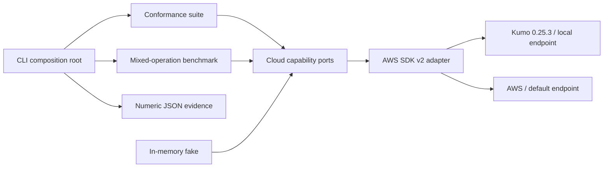

# AWS Emulator Conformance Benchmark: One SDK Adapter on Kumo and Real AWS

**Claim:** one AWS SDK v2 adapter preserves 18 scoped S3, SQS, and DynamoDB behaviors when switched between pinned Kumo and real AWS configuration.

**Benchmark:** `100%` conformance (`18/18` checks), `225` measured operations per run, `4.764 ms` aggregate median p95 across three runs, `478.878 ops/s` mean, and zero functional failures.

[](https://github.com/Brilhante29/mini-aws-emulator/actions/workflows/ci.yml)
[](LICENSE)
 

## Why this exists

Local cloud emulators make tests fast and free, but they quietly answer a different question: "does my code work against the emulator?" Teams then discover in production that a behavior they relied on differs on real AWS. The useful question is narrower and testable: for the operations my service actually uses, does the **same adapter and the same SDK calls** behave identically against the emulator and against AWS? This repository answers it for a scoped S3, SQS, and DynamoDB contract:

- S3 bucket and object lifecycle behavior works through the official AWS SDK v2.
- SQS queue, send, receive, delete, and list behavior preserves message bodies.
- DynamoDB table and item lifecycle behavior preserves strongly read values.
- One adapter targets Kumo through an endpoint override, or AWS through default endpoints; the suites depend on narrow capability ports, not AWS packages.
- Known emulator gaps are counted and reported (see the compatibility diagnostic), never silently ignored.
- The default path needs no cloud account, paid API, persistent data, or secret, and real AWS execution is refused without an explicit opt-in and a unique run identifier.

This project does not reimplement Kumo. It provides the compatibility, safety, architecture, and benchmark layer around a pinned Kumo runtime.

## Results

| Metric | Baseline | Confirmation | V2 aggregate | Direction |
|---|---:|---:|---:|---|
| conformance_rate_percent | 100 | 100 | 100 | exactly 100 |
| passed_checks | 18/18 | 18/18 | 18/18 | all |
| p95_operation_latency_ms | 1.715 | 1.605 | 4.764 | lower |
| operations_per_second | 730.145 | 850.726 | 478.878 | higher |
| measured_operations | 225 | 225 | 225/run | fixed |
| failed_operations | 0 | 0 | 0 | exactly 0 |
| startup_ms | 79.626 | 53.712 | n/a | lower |
| core_coverage_percent | 81.2 | 81.2 | 81.2 | >= 75 |
| sdk_response_close_warnings | 83 | 83 | 98 | diagnostic |

Inputs: five warmup iterations followed by 25 measured iterations of nine operations. Each iteration exercises S3 put/get/delete, DynamoDB put/get/delete, and SQS send/receive/delete through the official AWS SDK Go v2 adapter.

Environment recorded by the artifact: local Docker, Linux/amd64 image, Go 1.25.10, AWS SDK Go v2 1.41.9, Smithy Go 1.26.0, and Kumo 0.25.3. The Kumo image is pinned to `sha256:7ea090ae0b6d1d34615e8b7bd04a2f1cd864ec640a6826a91e90f40e975e196b`. Measured on 2026-08-14.

**How to read it:** the primary result is conformance, and it stayed at 100%. The V2 publication runs three independent repetitions and reports minimum conformance, median p95, mean throughput, summed failures, and minimum coverage. Single-digit local latencies are sensitive to scheduler noise and are not generalized to AWS production. Committed evidence: [`benchmarks/results/kumo-baseline.json`](benchmarks/results/kumo-baseline.json), [`benchmarks/results/kumo-confirmation.json`](benchmarks/results/kumo-confirmation.json), and [`benchmarks/publication/kumo-baseline-v2.json`](benchmarks/publication/kumo-baseline-v2.json).

### Publication V2

The publication artifact is generated by `tools/benchmark-v2.ps1` and validated against [`benchmark-result-v2.schema.json`](.portfolio/contracts/benchmark-result-v2.schema.json). It preserves samples and structured summaries for all three repetitions and binds the claim to the exact source commit, Docker image, dependency lock, fixture, configuration, and Kumo image digest.

| Publication field | Result |
|---|---:|
| repetitions | 3 |
| conformance_rate_percent | 100 |
| p95_operation_latency_ms | 4.764 |
| operations_per_second | 478.878 |
| failed_operations | 0 |
| core_coverage_percent | 81.2 |
| sdk_response_close_warnings | 98 |

Comparability key: `aws-sdk-kumo:2.0.0:kumo-0.25.3:sdk-1.41.9:go-1.25.10:s3-sqs-dynamodb:warmup-5:measure-25:c1`.

### Compatibility diagnostic

Kumo 0.25.3 completes the scoped S3 calls, but Smithy emits a response-body close warning after each S3 response. The logger converts only that exact known warning into `sdk_response_close_warnings`; every other SDK warning remains visible.

The expected count is deterministic:

```text
6 S3 conformance calls
+ 2 benchmark setup/cleanup calls
+ 5 warmup iterations * 3 S3 calls
+ 25 iterations * 3 measured S3 calls
= 98 diagnostics
```

This count is not treated as a functional pass or silently discarded. It records an SDK/emulator compatibility gap alongside the 18 behavioral assertions. Local S3 optional checksums are configured `when_required`; real AWS retains the SDK default.

## Quickstart

```bash
docker build -t mini-aws-emulator .
docker run --rm mini-aws-emulator
```

The second command starts Kumo inside the container, waits for health, executes the 18 checks, measures 225 operations, prints JSON, cleans up, and exits.

A two-container development path is also available:

```bash
docker compose up --build --abort-on-container-exit --exit-code-from conformance
```

## How it works


```mermaid
flowchart LR
  C["CLI composition root"] --> S["Conformance suite"]
  C --> B["Mixed-operation benchmark"]
  S --> P["Cloud capability ports"]
  B --> P
  P --> A["AWS SDK v2 adapter"]
  A --> K["Kumo 0.25.3 / local endpoint"]
  A --> W["AWS / default endpoint"]
  C --> R["Numeric JSON evidence"]
  F["In-memory fake"] --> P
```

Dependency direction:

```text
CLI + AWS adapter -> conformance/benchmark -> cloud capability ports
```

Only `internal/adapters/awssdk` imports AWS SDK packages. Kumo is an executable dependency, not a source-code dependency.

### Scoped contract

| Service | Checks |
|---|---|
| S3 | create bucket, put/get/list/delete object, delete bucket |
| SQS | create queue, send/receive/delete message, list/delete queue |
| DynamoDB | create table, put/get/delete item, confirm absence, delete table |

The benchmark measures nine functional operations per iteration. Setup, cleanup, and the 18 conformance checks are not included in operation latency.

### Local and real cloud

Local mode is the default:

```text
CLOUD_PROVIDER=kumo
CLOUD_ENDPOINT=http://127.0.0.1:4566
AWS_REGION=us-east-1
```

Real AWS uses the same adapter and SDK calls, but removes the endpoint override. It is deliberately guarded:

```bash
docker run --rm -e CLOUD_PROVIDER=aws -e ALLOW_REAL_AWS=true -e RUN_ID=portfolio-unique-20260715 -e AWS_REGION=us-east-1 -e AWS_ACCESS_KEY_ID -e AWS_SECRET_ACCESS_KEY mini-aws-emulator
```

Real mode creates and deletes billable resources. It is not run by CI and is not required for the portfolio result.

## Design decisions

| Decision | Why | Rejected |
|---|---|---|
| Hexagonal ports per cloud capability | S3, SQS, and DynamoDB are external behaviors that must stay substitutable behind small ports | A direct SDK script (couples behavior, configuration, measurement, and output); generic layers; microservices split by AWS service |
| One official AWS SDK v2 adapter for both targets | Both targets speak the AWS protocol, so one adapter prevents behavior drift | Separate local and AWS adapters that duplicate calls |
| Kumo pinned by version and OCI digest | Reproducible emulator behavior; project validation rejects mutable images | Reimplementing S3, SQS, and DynamoDB (duplicates Kumo instead of proving compatibility); LocalStack (Kumo is the portfolio standard and a smaller Go-native dependency) |
| A CLI for a finite conformance run | No long-lived service is needed to prove parity | REST, GraphQL, gRPC, or a UI: transport surface without improving parity |
| SQS as the tested queue | It is part of the AWS contract under test | Kafka or RabbitMQ: they solve application messaging, not an AWS queue contract |

The in-memory fake tests orchestration and Liskov substitution; Kumo tests protocol integration. The suite claims only the listed operations, not complete AWS compatibility.

### SOLID and simplicity

- SRP: configuration, ports, adapter, conformance, benchmark, diagnostics, and reporting are separate.
- OCP: another cloud implementation can satisfy the three ports without changing the suites.
- LSP: the in-memory fake and AWS adapter preserve the behavior expected by conformance and benchmark code.
- ISP: object, queue, and key-value ports expose only operations used by the proof.
- DIP: core packages depend on capability interfaces; AWS SDK dependencies point inward through the adapter.
- KISS: one binary, one adapter, three services, 18 checks, one JSON contract.
- YAGNI: no custom emulator, broker, database layer, web API, Kubernetes, Terraform, or generic plugin framework.

## Testing

```bash
docker build -t mini-aws-emulator .
docker run --rm -e BENCHMARK_ITERATIONS=2 mini-aws-emulator
powershell -NoProfile -ExecutionPolicy Bypass -File tools/validate-project.ps1
```

The Docker build runs `go test`, `go vet`, and enforces at least 75% coverage across conformance, benchmark, report, and runtime configuration packages.

## Limitations

- The result covers 18 listed behaviors, not the full AWS APIs or all 81 services implemented by Kumo.
- IAM, policies, quotas, throttling, encryption, multi-region behavior, and managed durability are not emulated.
- Optional S3 checksum parity is excluded from the local contract and reported as a compatibility limitation.
- The performance result is local Docker throughput, not AWS regional latency or production capacity.
- Real AWS parity is pluggable but intentionally absent from CI to avoid credentials, cost, and destructive side effects.

## Reproducibility

1. Clone the repository and run the Quickstart commands; the JSON result prints to stdout.
2. Save a new baseline with `tools/benchmark.sh` (Linux and macOS) or `tools/benchmark.ps1` (Windows).
3. Regenerate the publication evidence with the required three repetitions: `pwsh -NoProfile -File tools/benchmark-v2.ps1 -Repeat 3`.
4. Compare the output with [`benchmarks/results/`](benchmarks/results) and [`benchmarks/publication/`](benchmarks/publication).

## Project structure

```text
cmd/conformance/              composition root, safety guard, JSON result
internal/cloud/               provider-independent capability ports
internal/conformance/         18 scoped behavioral checks
internal/benchmark/           nine-operation measured loop
internal/adapters/awssdk/     Kumo/AWS SDK adapter and diagnostics
internal/report/              stable numeric result contract
internal/runtimeconfig/       environment parsing and AWS opt-in guard
benchmarks/results/           committed baseline and confirmation
sdd/                          decisions, benchmark plan, handoff, reuse review
openspec/artifacts/           generated spec and verification graph
```

## How this repository is built

The project follows the spec-driven workflow of [portfolio-reuse-kit](https://github.com/Brilhante29/portfolio-reuse-kit). Requirements and decisions live in [`sdd/`](sdd) and [`openspec/`](openspec), and [`project.yaml`](project.yaml) records the architecture, stack, and rejected alternatives. Development is AI-assisted and human-governed: [`AGENTS.md`](AGENTS.md) and [`CLAUDE.md`](CLAUDE.md) hold the coding-agent instructions, while tests, validators, and CI decide what gets published.

## Related work

- [terraform-aws-baseline](https://github.com/Brilhante29/terraform-aws-baseline): one Terraform module applied to Kumo locally and to AWS by switching only the provider adapter.
- [kiri-aws](https://github.com/Brilhante29/kiri-aws): a Kumo-based AWS emulator I maintain, with a cost surface (Cost Explorer, Budgets) and a Time Machine API.
- [cost-aware-inference](https://github.com/Brilhante29/cost-aware-inference): the same local-first approach applied to model inference.

See [`REFERENCES.md`](REFERENCES.md) for primary sources, versions, licenses, and organization references.

## Author

**Guilherme Brilhante**, software engineer working on scalable backends and production AI.
[LinkedIn](https://www.linkedin.com/in/guilhermefreirebrilhanteseveriano/) · [GitHub](https://github.com/Brilhante29) · [Publications](https://dblp.org/pid/353/6812.html)

## License

[MIT](LICENSE).
